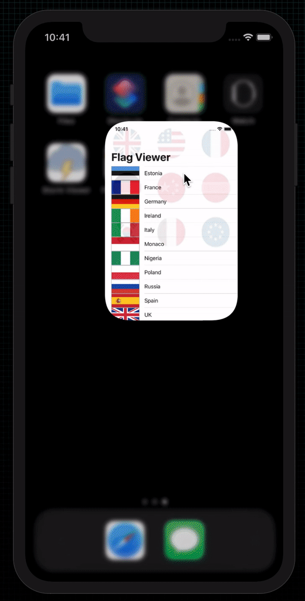

# Flag Viewer

  

 
Displays a list of various world flags. When one of them is tapped, shows a full sized image. There is then an option to share the image.

## Examples within this code
- Table Views
- Image Views
- App bundles
- FileManager
- Typecasting
- View controllers
- Storyboards
- Interface Builder
- AutoLayout
- IBOutlets
- CALayer
- UIColor
- UIImage
- UIAlertController
- UIBarButtonItem
- UIActivityViewController

## Demonstration
Small demonstration as to what the application does when on device.
 

